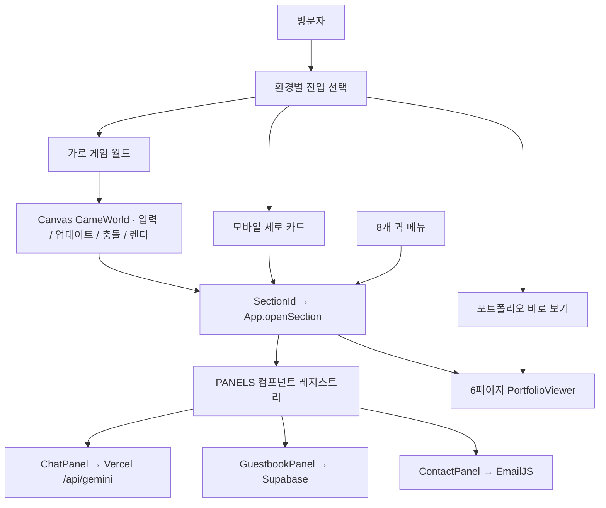
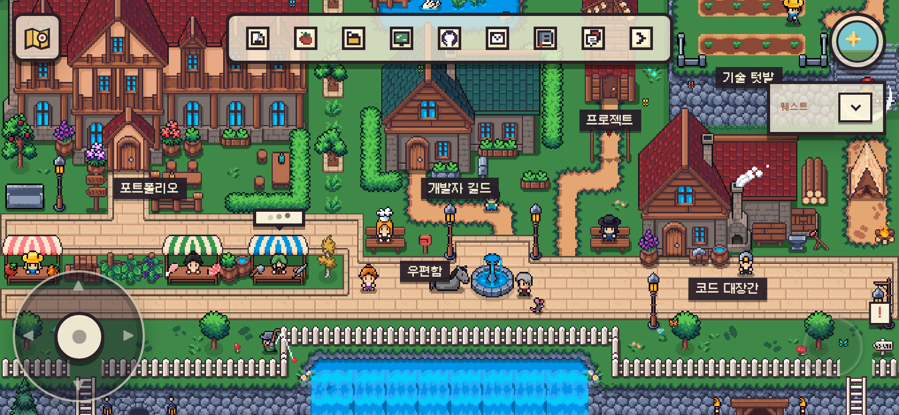
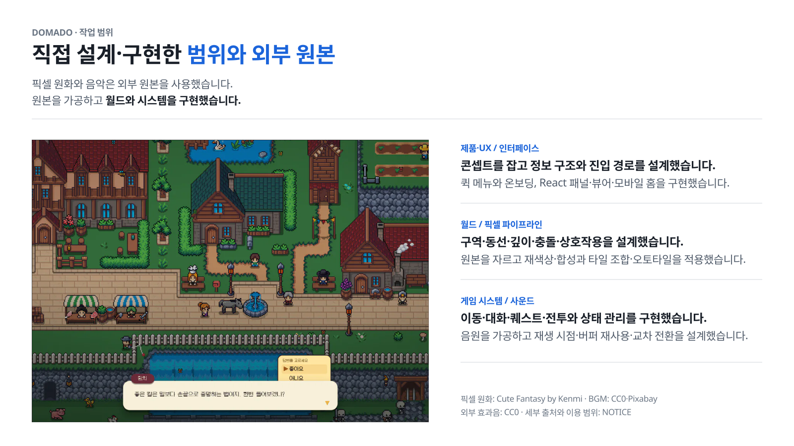

  

<h1 align="center">DOMADO</h1>

  <strong>소개·프로젝트·기술을 직접 탐색하는 픽셀 마을 포트폴리오</strong> 
  박건호 · 백엔드 중심 풀스택 개발자 
  1인 기획 · 월드 설계 · 개발 · 최적화

  <a href="https://domado.me"><strong>DOMADO 플레이</strong></a>
  ·
  <a href="#프로젝트-한눈에-보기"><strong>프로젝트 개요</strong></a>
  ·
  <a href="./docs/engineering-cases.md"><strong>엔지니어링 사례</strong></a>
  ·
  <a href="./docs/development-history.md"><strong>전체 개발 과정</strong></a>
  ·
  <a href="https://github.com/DO-MADO"><strong>GitHub 프로필</strong></a>

 

DOMADO는 픽셀 마을을 탐험하며 소개·프로젝트·기술을 찾아보는 웹 포트폴리오입니다.   게임을 하지 않고 포트폴리오나 모바일 카드로 바로 들어갈 수도 있습니다.   기획부터 개발·배포까지 직접 맡아, 마을의 동선과 상호작용을 설계하고 화면과 게임 시스템을 구현했습니다.

 
 

## 프로젝트 한눈에 보기

| 질문 | 답 |
| --- | --- |
| 무엇을 만들었나 | React·TypeScript·Canvas 2D로 만든 `672×448` 탐험형 포트폴리오 |
| 개발 기간 | 2025.11~2026.08 · 1인 기획·설계·개발·배포 |
| 핵심 기술 | React 19, TypeScript, Vite, Canvas 2D, Web Audio, Vercel Serverless |
| 담당 범위 | 제품 콘셉트, 정보 구조, 월드·상호작용, React UI, 모바일 분기, 서버리스 연동, 성능 계측 |

 

### DOMADO 월드의 세 가지 특징

- **마을이 곧 탐색 메뉴 :**
  - 길드·텃밭·풍차·보관소를 소개·기술·프로젝트·기록과 연결했습니다.
  - 방문자는 걷고 대화하며 보고 싶은 정보를 고릅니다.
    
- **직접 연결한 월드 시스템 :**
  - 별도 게임 엔진 없이 React·Canvas 2D로 이동·충돌·퀘스트·전투를 구현하고 낮·밤, 작물 성장, 사운드를 연결했습니다.
    
- **탐험하지 않아도 열람할 수 있습니다.**
  - 데스크톱·모바일 가로에서는 마을을 탐험합니다.
  - 게임 없이 6페이지 포트폴리오를 열거나 모바일 세로의 퀵메뉴 카드로 원하는 정보를 볼 수도 있습니다.

  

 

## 왜 포트폴리오를 게임으로 만들었나

프로젝트와 기술을 정리하는 것만으로는 제가 어떤 사람인지 충분히 표현하기 어렵다고 느꼈습니다. 
제가 좋아하는 레트로 게임을 바탕으로 제 취향과 감성을 담은 공간을 만들고 싶었습니다. 
방문자가 모험하고 상호작용하며 저를 알아가는 과정 자체를 즐겼으면 했습니다. 
 
첫 구현은 부팅 화면과 드래그 창을 갖춘 레트로 OS였지만 메뉴를 열고 목록을 읽는 방식은 그대로였습니다. 
방문자가 직접 걷고 발견할 수 있도록 메뉴를 공간으로 바꾸고 **도마도 월드**를 만들었습니다. 
 
소개와 기술은 길드·텃밭에, 프로젝트와 기록은 풍차·보관소에 연결했습니다. 
길과 지형, 건물과 NPC, 이벤트를 하나씩 구상하며 마을을 구성했습니다. 
배경음악과 발걸음 소리도 장면과 행동에 맞춰 고르고 연결하며 마을의 분위기를 다듬었습니다. 
 
내용만 빠르게 확인하고 싶은 방문자를 위해 게임 없이 포트폴리오를 바로 읽는 경로도 함께 만들었습니다.

 
 

## 탐험은 선택지로 남겼습니다

| 경로 | 데스크톱 | 모바일 세로 | 역할 |
| --- | :---: | :---: | --- |
| 마을 탐험하기 | O | O · 선택 후 가로 전환 | 걷고 대화하며 건물·주민에 연결된 기록 발견 |
| 포트폴리오 바로 보기 | O | O | 게임 없이 포트폴리오 열람 |
| 카드로 빠르게 보기 | — | O | 화면을 돌리지 않고 카드 메뉴로 접근 |

정보 지점으로 연결한 건물·안내 NPC와 상단 QuickMenu는 같은 React 패널 라우터를 사용합니다.  
일반 주민과 상인은 월드 안에서 사용자와 상호작용합니다.  
키보드 focus trap·Escape 복귀·감소 모션도 적용해 게임을 건너뛰어도 핵심 정보에 바로 들어갈 수 있습니다.

 

  

 
 

## 시스템 구조

마을·퀵 메뉴·모바일 카드는 같은 화면 연결 규칙을 사용합니다.  
`포트폴리오 바로 보기`는 시작 화면에서 뷰어를 바로 엽니다.  

  

텍스트 흐름도 보기

| 경계 | 소유하는 상태 | 판단 |
| --- | --- | --- |
| React `App` | 진입, 패널, 퀘스트, 포트폴리오, 전체화면 | 화면 전환처럼 변경 빈도가 낮고 UI 일관성이 중요한 상태 |
| Canvas `GameWorld` | 좌표, 애니메이션, 충돌, 공격, 카메라 | 매 프레임 바뀌는 값을 React 렌더에서 분리 |
| 공용 라우터·레지스트리 | `SectionId`, `openSection`, `PANELS` | 월드·QuickMenu·MobileHome이 같은 패널 연결 규칙 사용 |
| 서버리스 핸들러 | API 키, 입력 제한, 공급자 오류 변환 | 비밀은 서버에 두고 클라이언트가 처리할 오류 응답 형식을 정의 |
| 외부 서비스 연동 | 방명록과 연락 폼 요청 | 입력 검사·DOMPurify 뒤 Supabase·EmailJS로 브라우저에서 직접 연결 |

근접 대상처럼 실제 UI 표시가 바뀌는 순간에만 Canvas 상태를 React로 올립니다.  
React와 Canvas의 경계는 **변경 빈도와 상태 소유권**으로 정했습니다.

 

 

### 기술별 역할과 요청 경로

React와 Canvas는 브라우저 안에서 역할을 나눕니다. 
Gemini 요청은 서버리스 함수를 거치고 방명록과 연락 폼은 브라우저에서 각각 Supabase·EmailJS로 연결합니다.

  

 
 

## 대표 엔지니어링 판단

### Gemini 호출을 브라우저 밖으로 옮긴 이유

초기 버전은 `VITE_*` 환경 변수의 Gemini 키를 브라우저에서 읽었습니다.  
빌드 결과에 비밀이 포함되지 않도록 Gemini 호출은 Vercel Serverless Function에서 처리했습니다.

- `POST`만 받고 JSON을 파싱하며 Origin이 있는 요청은 host와 대조합니다.
- raw 요청의 Content-Length와 문자열 길이에 상한을 두고 질문은 500자, 이전 대화는 4개, 메시지는 600자로 제한합니다.
- 키와 시스템 지식은 서버에서만 사용하고 응답은 `no-store`로 보냅니다.
- 공급자의 `429 / 404 / 그 밖의 upstream 실패`를 구분해 클라이언트에 제한·오프라인 상태로 표시합니다.

Gemini 호출의 **비밀 관리·입력 제한·실패 응답 처리**를 서버 인터페이스 하나에 모았습니다.

 

 

### 일곱 차례에 걸친 성능 병목 개선

사용자에게 먼저 영향을 주는 병목부터 고쳤고 측정 조건이 다른 결과는 사례별로 비교했습니다.

| 관찰한 문제 | 변경 | 확인한 결과 |
| --- | --- | --- |
| 고주사율에서 흔들리는 프레임 간격 | 실행 간격·기한·RAF 호출 누락 보정 | 120Hz 10초에서 `20ms 초과 간격 22회→0` |
| 늦게 준비되는 포트폴리오 물결 영상 | 영상 재인코딩과 전환 중 준비를 함께 적용 | 영상 `6,178,980→2,209,111B`, 재생 준비 `2.125→1.398초` |
| 시작 화면·패널 뒤에서 계속되는 월드 렌더 | 진입 전 루프 중단, 패널 뒤 완성 프레임 재사용 | 회전 대기 `20,400 drawImage/s→0`, 모바일 패널 `36,720→238 drawImage 호출/2초` |

1~7차의 측정 환경과 결과는 [엔지니어링 사례](./docs/engineering-cases.md#1-일곱-차례의-성능-개선)에 기록했습니다.

 

#### 초기 월드 로드는 첫 선택 뒤에

시작 화면 뒤에서 GameWorld가 바로 마운트되며 픽셀 아트 로드와 Canvas 합성을 시작했습니다.  
반복 RAF를 멈춰도 첫 초기화 비용은 그대로 남았습니다.

첫 화면에서는 GameWorld를 마운트하지 않고 게임을 고른 뒤 2.8초 전환 화면에서 월드를 준비하도록 바꿨습니다.  
포트폴리오와 모바일 카드 경로는 게임 초기화를 건너뜁니다.  
전체 Galmuri 로드도 첫 선택 뒤로 미루고 공용 월드 SVG의 브라우저 전송량은 `334,820→184,596B`로 줄였습니다.

 

2026년 8월 25~26일, 수정 전후 프로덕션 빌드를 같은 모바일 Lighthouse 환경에서 각각 5회 실행했습니다. 아래는 중앙값입니다.

| 모바일 Lighthouse 13.4.1 · 5회 중앙값 | 수정 전 | 수정 후 | 변화 |
| --- | ---: | ---: | ---: |
| 성능 점수 | 75 | 88 | +13 |
| LCP | 6.92초 | 3.46초 | -3.46초 · -50.0% |
| 총 전송량 | 1,606,640B | 433,644B | -73.0% |
| 메인 스레드 작업 | 781ms | 697ms | -10.8% |
| FCP | 2.10초 | 2.40초 | +0.30초 · 느려짐 |

LCP와 전송량은 줄었지만 FCP는 0.30초 느려졌습니다. 수정 후 LCP 3.46초도 더 줄여야 합니다.  
실제 사용자 지표가 아닌 동일 조건 실험실 비교이며 자세한 환경과 한계는 [7차 성능 사례](./docs/engineering-cases.md#7차--시작-화면의-네트워크와-메인-스레드)에 정리했습니다.

 

 

### 모바일 화면과 입력 정책

- 월드 좌표와 `672×448` backing store는 하나만 유지했습니다.
- 모바일 가로는 폭 전체를 보여 주고 세로축만 플레이어를 추적합니다.
- 플로팅 조이스틱과 상황별 단일 액션으로 입력 밀도를 줄였습니다.
- 세로 화면에서는 게임을 조작하는 대신 8개 카드로 정보를 볼 수 있습니다.
- Safari 문제를 동적 viewport, font swap, WebKit 재래스터링으로 나눠 수정했습니다.

  

증상은 실제 iPhone에서 확인했고 `390×844 / 844×390 / 844×290` 조건의 좌표·흐름 회귀 검사는 Chromium 자동화로 보완했습니다. 
모바일 확인 조건은 [모바일 사례](./docs/engineering-cases.md#3-고정-픽셀-월드를-모바일에-유지하기)에, 확인한 기기와 Safari 검증 한계는 [Safari 사례](./docs/engineering-cases.md#4-iphone-safari-viewport-font-swap-raster를-분리하기)에 기록했습니다.

 

### 그 밖의 트러블슈팅

| 문제 | 원인과 적용한 해결 | 상세 기록 |
| --- | --- | --- |
| 짧은 효과음의 중복 decode와 장면 전환 중 BGM 겹침 | 필요 시 decode, Promise·AudioBuffer 재사용, 사용자 입력 재시도와 GainNode 교차 전환 적용 | [오디오 수명 주기](./docs/engineering-cases.md#5-오디오를-화면-상태의-수명-주기로-다루기) |
| 장애물 사이 NPC가 반대 방향만 반복하며 끼임 | 재현 검사를 만든 뒤 NPC 전용 회피 영역과 축별 우회, 방향 유지 시간을 추가 | [NPC 이동](./docs/engineering-cases.md#6-npc-끼임-재현부터-이동-정책까지) |
| 미사용 유료 원본이 `public/`을 통해 함께 배포될 위험 | 실행 참조와 allowlist를 감사하고 추적 자산을 `1,008→126`개로 축소 | [에셋 배포 경계](./docs/engineering-cases.md#8-라이선스-에셋을-런타임-월드로-통합하기) |

 
 

## 직접 설계한 범위와 외부 자산

  

| 영역 | 직접 설계·구현한 범위 | 사용한 외부 원본 |
| --- | --- | --- |
| 제품·UX | 콘셉트, 정보 구조, 환경별 진입 분기, 퀵 메뉴, 온보딩 | — |
| 월드 | 구역·동선·깊이·충돌·상호작용, 타일 조합과 오토타일 규칙 | Cute Fantasy by Kenmi 픽셀 아트 |
| 픽셀 파이프라인 | sprite crop, 투명색 처리, 재색상, 회전·반전, 합성, 9-slice | 라이선스 원본 스프라이트·타일셋 |
| 게임 시스템 | 이동, 대화, 조사, 퀘스트, 전투, 낮·밤, 작물, NPC·동물 상태 | — |
| 인터페이스 | React 패널, 6페이지 뷰어, 모바일 8카드 홈, 반응형 분기 | — |
| 사운드 | 출처 확인, 선별, 재인코딩, 재생 시점, buffer 재사용, 교차 전환 | CC0·Pixabay 라이선스 BGM/SFX |

픽셀 원화와 음악은 표에 적은 외부 원본을 사용했습니다.  
직접 기여한 범위는 원본의 선별·가공과 좌표·깊이·상태·충돌·오디오 수명 주기 설계, 그리고 이를 하나의 월드로 통합한 작업입니다.

이 저장소에는 공개 가능한 화면·구조·검증 기록만 담았습니다.  
유료 원본과 이를 포함한 구현 저장소 이력은 공개하지 않으며 세부 출처와 이용 범위는 [NOTICE](./NOTICE.md)에 기록했습니다.

 
 

## 전체 개발 과정

| 기간 | 전환점 | 결과 |
| --- | --- | --- |
| 2025.11~2026.02 | 레트로 OS형 포트폴리오 | 창·앱 구조와 Supabase·EmailJS·Gemini·오디오 연동 구축 |
| 2026.07.09~13 | OS 셸 폐기, Canvas 월드 전환 | 콘텐츠는 보존하고 이동·충돌·대화·전투·공용 패널을 새로 설계 |
| 07.13~08.02 | 모바일과 살아 있는 마을 | 카메라·조이스틱·퀘스트·낮밤·농장·포트폴리오 뷰어·온보딩 구현 |
| 08.04~25 | 전달 비용·실기기·배포 마감 | 7차 성능 개선, 서버리스 오류 계약, iPhone Safari, 공개 자산 경계 정리 |

각 전환점을 선택한 근거는 [전체 개발 연대기](./docs/development-history.md)에 남겼습니다.

 
 

## 검증

아래는 2026년 8월 비공개 구현 저장소에서 남긴 검증 기록입니다. 이 문서 저장소에는 앱 소스와 실행용 `package.json`이 없습니다.

- `npx tsc --noEmit`과 production build 통과
- 모바일 세로 8카드 경로에서 8개 카드와 콘솔 오류 0 확인
- 7차 변경 뒤 게임·포트폴리오 진입과 `390×844→844×390` 회전 확인

당시 정적 검사 40개 중 11개는 최종 구현과 기대값이 어긋나 판정이 남았고, 브라우저 전체 시나리오도 모두 다시 실행하지는 않았습니다. 
검증 범위와 남은 작업은 [엔지니어링 사례의 마지막 절](./docs/engineering-cases.md#9-검증-상태와-다음-작업)에 기록했습니다.

 
 

## 상세 기록

- [제품 방향이 바뀐 전체 개발 연대기](./docs/development-history.md)
- [성능·상태 경계·모바일·Safari·오디오·NPC·서버리스 사례](./docs/engineering-cases.md)
- [외부 픽셀 아트·음악·효과음 고지](./NOTICE.md)

 
 

---

  <strong>게임으로 둘러보거나, 포트폴리오로 바로 들어가 보세요.</strong>  
  <a href="https://domado.me"><strong>DOMADO 플레이</strong></a>
  ·
  <a href="https://github.com/DO-MADO"><strong>GitHub 프로필 · 박건호</strong></a>

  © 2026 DO-MADO. 자체 작성 텍스트·기획·편집 구성의 권리를 보유합니다. 
  외부 픽셀 원화와 음원의 권리는 각 원저작자 및 <a href="./NOTICE.md">NOTICE</a>의 라이선스를 따릅니다.

